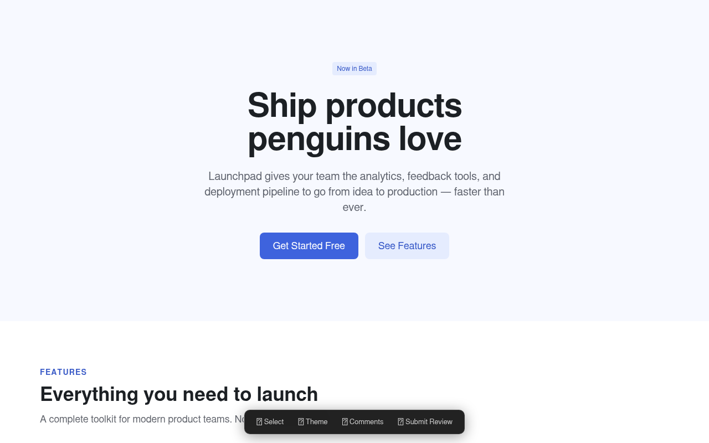
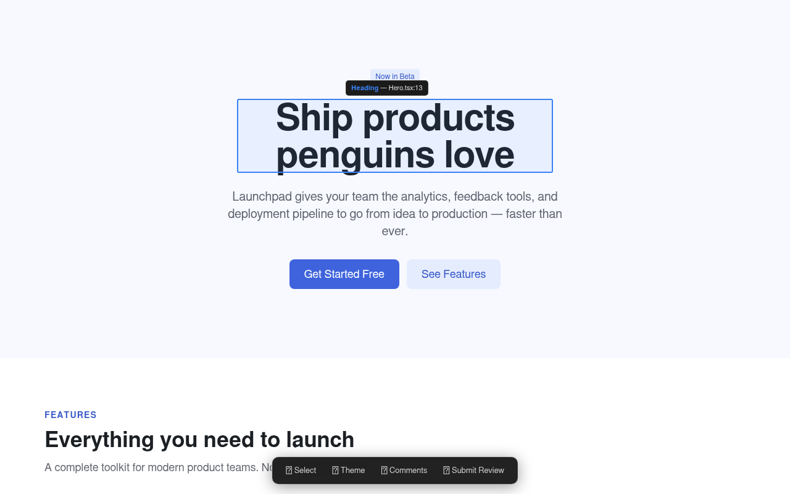
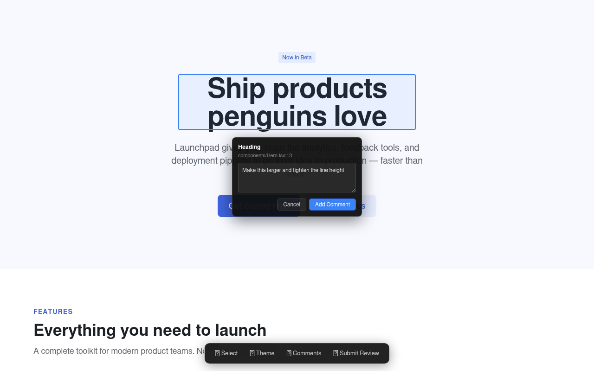
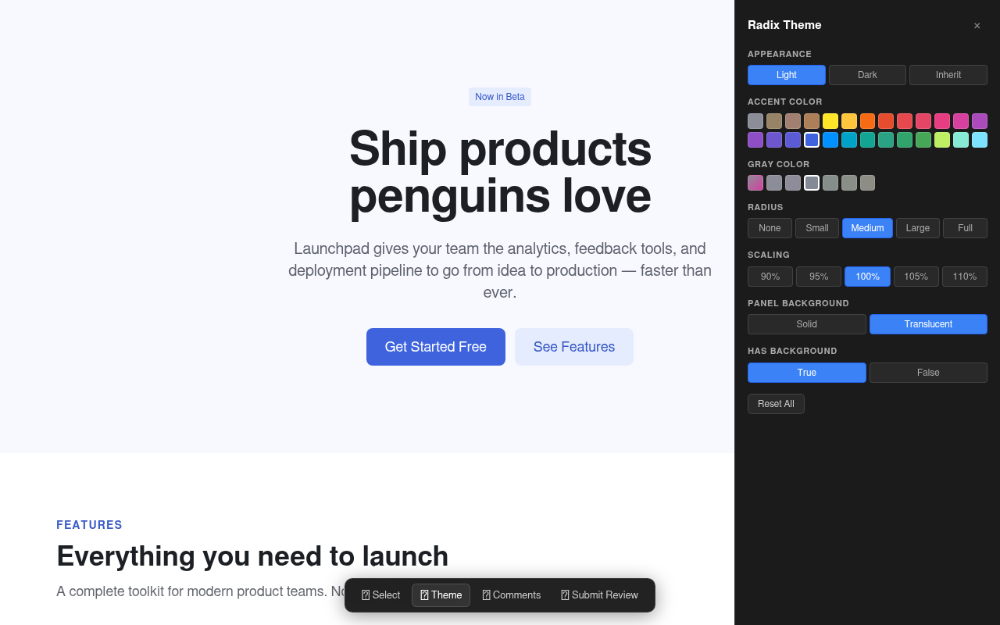

# live-design

A browser overlay + MCP server that lets a designer review a running React app — pick components, leave comments tied to source lines, and edit the Radix Themes config — then ship the structured review back to a Claude Code agent that applies the changes in code.



## What's in the loop

```
        Designer                         Agent (Claude Code)
        --------                         -------------------

    1.                       <--------   start_session({ command: "npm run dev" })
    2.  Opens dev server URL
        Overlay activates    <--------   wait_for_review()
    3.  Click Select, pick components,
        write comments, tweak theme
    4.  Click Submit Review
    5.  Overlay freezes      -------->   wait_for_review() returns:
                                          - comments (component + file:line)
                                          - themeChanges (Radix prop diffs)
                                          - feedback (free text)
    6.                                   Agent edits code...
    7.  Overlay unfreezes    <--------   request_feedback("Applied X")
    8.  HMR shows changes
        Review again (back to 3)
```

## Features

### Component selector with source-mapped locations

Click **Select**, hover any element, and the overlay walks the React fiber tree to find the component, then parses the JSX `_debugStack` (React 19) and decodes the Vite source map to get the original source line. Comments stick to the exact line in your source file, not the compiled output.



### Comment popover

Click a highlighted element to open a comment popover. The component name, file path, and line number are baked into the comment payload that the agent receives.



### Radix Themes editor

If the page is wrapped in `<Theme>` (Radix Themes is detected via `[data-is-root-theme="true"]`), the overlay exposes the full prop surface — Appearance, Accent Color, Gray Color, Radius, Scaling, Panel Background, Has Background — as a native control panel. Changes update the data attributes for live preview *and* get sent to the agent so it can edit the `<Theme>` props in source.



The Theme button only appears when Radix is detected. You can also extend the panel with custom CSS variables via the `themeVariables` config option.

## Architecture

```
packages/
  shared/         Message protocol types (no build step — consumed as raw TS)
  overlay/        Browser overlay (vanilla TS, shadow DOM, ~2200 LOC)
  vite-plugin/    Injects overlay into the dev server via transformIndexHtml
                  + serves overlay dist files via dev server middleware
  mcp-server/     MCP stdio server + WebSocket bridge on port 24678
skills/
  live-design/    Claude Code skill that drives the review loop via the MCP tools
example/          Demo Radix Themes landing page
```

The overlay communicates with the MCP server via WebSocket on port 24678. The MCP server exposes five tools to Claude Code over stdio.

## Setup

### 1. Build the packages

```bash
git clone git@github.com:loren-arthur/live-design.git
cd live-design
npm install
npm run build --workspaces
```

### 2. Add the Vite plugin to your app

```ts
// vite.config.ts
import { defineConfig } from "vite";
import react from "@vitejs/plugin-react";
import { liveDesign } from "@live-design/vite-plugin";

export default defineConfig({
  plugins: [
    react(),
    liveDesign({
      author: "Designer",
      // optional — extend the theme panel with custom CSS variables
      themeVariables: ["--brand-logo", "--my-custom-var"],
    }),
  ],
});
```

### 3. Register the MCP server with Claude Code

Either as a project-level MCP (`.mcp.json` in the repo root):

```json
{
  "mcpServers": {
    "live-design": {
      "command": "node",
      "args": ["/absolute/path/to/live-design/packages/mcp-server/dist/index.js"]
    }
  }
}
```

…or globally via `~/.claude.json`.

### 4. Install the Claude Code skill (optional but recommended)

A skill at [`skills/live-design/SKILL.md`](./skills/live-design/SKILL.md) teaches Claude Code how to drive the review loop — when to call each MCP tool, how to map comments back to source files, and the common pitfalls to avoid.

Copy or symlink it into your Claude Code skills directory:

```bash
# User-level (available in every project)
mkdir -p ~/.claude/skills
ln -s "$(pwd)/skills/live-design" ~/.claude/skills/live-design

# …or project-level (only for this repo)
mkdir -p .claude/skills
ln -s ../../skills/live-design .claude/skills/live-design
```

Prefer `ln -s` over `cp -r` so the skill stays in sync as this repo updates. Once installed, Claude Code will pick it up automatically when the user asks to start a design review.

## For the designer

Once setup is done (by a developer, one time), the per-review flow is:

1. Type `/live-design` in Claude Code.
2. Open the URL it gives you in your browser.
3. Click **Select**, pick components, leave comments, tweak the theme.
4. Click **Submit Review**.
5. Wait a moment — the agent edits the code and the page reloads.
6. Review again. Repeat until it looks right.

That's the whole loop. You don't need to run commands or touch Claude Code again until you want to start a new review.

## MCP tools

| Tool | Description |
|------|-------------|
| `start_session` | Spawns a dev server (or targets a running one) and starts a review session. Pass `command` (e.g. `"npm run dev"`) or `target` (URL). |
| `wait_for_review` | Blocks until the designer submits. Returns comments + theme changes + feedback. |
| `request_feedback` | After the agent edits code, unfreezes the overlay so the designer can review again. |
| `get_session_state` | Non-blocking snapshot of the current session. |
| `stop_session` | Kills the spawned dev server and resets the session. |

## Try the example

```bash
npm run dev --workspace=example
# open http://localhost:5173
```

The example is a small Radix Themes landing page. With the MCP server registered, the agent can call `start_session` against it and walk through the full review loop.

## License

MIT
